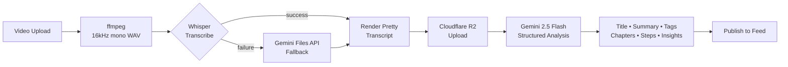

<div align="center">

# Hyvemind

### *An intelligent knowledge library that turns videos into structured, searchable, AI-curated learning paths.*

[](#tech-stack)
[](#the-ai-pipeline)
[](#architecture)
[](#tech-stack)
[](#license)

</div>

---

## What is Hyvemind?

Hyvemind is a **dark-themed knowledge library** built for teams and creators who learn by watching. Drop in a how-to video and Hyvemind:

1. **Transcribes** it locally with `faster-whisper` (with an automatic Gemini fallback).
2. **Analyses** the transcript with Gemini 2.5 Flash — generating a polished title, summary, tags, chapters, key takeaways, and step-by-step instructions.
3. **Publishes** the result as a beautiful, scrollable content card with **Apple Music-style live transcript sync**, native CC subtitles, watch-progress tracking, and one-tap seek-to-segment.

It's the bridge between *"I'll watch that later"* and *"I already know what's in there and where the bit I want lives."*

---

## ✨ Key Features

<table>
<tr>
<td width="33%">

### 🎬 Smart Pipeline
Upload → ffmpeg audio extraction → faster-whisper transcription → R2 storage → Gemini 2.5 Flash structured analysis → publish. Every step is observable in real time.

</td>
<td width="33%">

### 📝 Live Synced Transcript
Apple-Music-style transcript that scrolls with the playhead. Click any line to jump there. Native HTML5 CC track for in-video subtitles.

</td>
<td width="33%">

### 🛟 Failsafe Transcription
If faster-whisper fails (model load, CUDA, VAD), the pipeline automatically falls back to **Gemini Files API** for transcription. Zero manual intervention.

</td>
</tr>
<tr>
<td>

### 🔐 Production Auth
Clerk-powered sign-in (Google, GitHub, email) on the frontend; JWKS-verified bearer tokens on the FastAPI backend. Per-user data isolation.

</td>
<td>

### 🗄️ Dual-Store Architecture
**Neon Postgres** holds private pipeline state. **Supabase** is the public content feed. **R2** stores video. **Upstash Redis** caches statuses and rate-limits. Each layer does one job well.

</td>
<td>

### 🎨 Hand-Crafted UI
Built with shadcn/ui + Tailwind. Neon-violet on deep navy, blueprint-grid backgrounds, scroll-revealed sections, and motion that respects `prefers-reduced-motion`.

</td>
</tr>
</table>

---

## 🧠 The AI Pipeline



**Whisper config (top-grade quality):** `small` model, `beam_size=5` (full beam search), VAD with speech padding, `condition_on_previous_text=True`, `initial_prompt` seeded with the user-supplied title for proper-noun spelling.

**Gemini config:** `gemini-2.5-flash`, `temperature=0.0`, response forced to JSON, vocab-hinted from the contribution title. Returns `title, summary, tags, topics, keyTakeaways, actionItems, notableInsights, qualityFlags, chapters[], steps[]`.

---

## 🏗️ Architecture

```
┌─────────────────────────────────────────────────────────────────────┐
│                          Browser (React + Vite)                     │
│                                                                     │
│   Clerk Auth      Supabase JS (anon)      fetch(/api/...)           │
└────────┬───────────────┬──────────────────────┬──────────────────────┘
         │               │                      │
         ▼               ▼                      ▼
   ┌──────────┐   ┌──────────────┐     ┌──────────────────┐
   │  Clerk   │   │   Supabase   │     │  FastAPI :8787   │
   │ (OAuth)  │   │ public feed  │     │  (Clerk JWT)     │
   └──────────┘   │  watch_prog  │     └────┬─────────────┘
                  │  profiles    │          │
                  └──────────────┘          │
                                            ▼
                          ┌─────────────────────────────────────┐
                          │          Backend Services           │
                          │                                     │
                          │  Neon Postgres   ← pipeline state   │
                          │  Cloudflare R2   ← video / audio    │
                          │  Upstash Redis   ← cache + ratelim  │
                          │  Gemini API      ← transcribe + AI  │
                          │  faster-whisper  ← local transcribe │
                          │  ffmpeg          ← audio extract    │
                          └─────────────────────────────────────┘
```

See [`docs/ARCHITECTURE.md`](docs/ARCHITECTURE.md) for service topology, data flow, and per-module deep dive.

---

## 🚀 Quick Start

### Prerequisites
- Node.js ≥ 18
- Python ≥ 3.10
- ffmpeg (`brew install ffmpeg`)
- A Clerk app, Supabase project, Neon database, Cloudflare R2 bucket, Upstash Redis instance, and Gemini API key. See [`.env.example`](.env.example) for the full list.

### One-command boot

```bash
git clone https://github.com/iamadarsha/LMS-Platform.git
cd LMS-Platform
cp .env.example .env       # fill in your credentials
bash scripts/start.sh
```

This installs dependencies, sets up the backend venv, starts FastAPI on `127.0.0.1:8787`, and opens Vite on `localhost:8080`.

### Manual

```bash
# Frontend
npm install && npm run dev

# Backend (in another shell)
cd backend
python -m venv .venv && .venv/bin/pip install -r requirements.txt
.venv/bin/python main.py
```

### Apply Supabase migrations

```bash
SUPABASE_PAT=sbp_...  SUPABASE_PROJECT_REF=...  bash scripts/apply-migrations.sh
```

(Uses the Supabase Management API — no DB password required.)

---

## 🧰 Tech Stack

| Layer | Tooling |
|-------|---------|
| **Frontend** | React 18 · TypeScript strict · Vite · Tailwind CSS · shadcn/ui · Clerk |
| **Backend** | Python 3.10+ · FastAPI · uvicorn · Pydantic · psycopg3 |
| **AI / ML** | faster-whisper (vendored) · Google Gemini 2.5 Flash · ffmpeg |
| **Data** | Neon Postgres · Supabase Postgres · Cloudflare R2 · Upstash Redis |
| **Auth** | Clerk (frontend) · Clerk JWKS verification (backend) |
| **Hosting** | Vercel-ready frontend · Railway/Render-ready backend |

---

## 📁 Repo Layout

```
.
├── src/                    # React frontend
│   ├── pages/              # Route-level components
│   ├── components/         # Reusable UI (shadcn/ui + custom)
│   ├── data/               # Stores, API clients, content models
│   └── integrations/       # Supabase typed client
├── backend/                # FastAPI service (port 8787)
│   ├── main.py             # Routes + lifespan
│   ├── pipeline.py         # Whisper → R2 → Gemini orchestration
│   ├── auth.py             # Clerk JWKS verification
│   ├── db.py               # Neon Postgres CRUD
│   ├── r2.py               # Cloudflare R2 (S3 SDK + REST fallback)
│   └── cache.py            # Upstash Redis REST
├── vendor/faster-whisper/  # Vendored — no clone needed
├── supabase/migrations/    # Public-feed schema (8 migrations)
├── docs/                   # ARCHITECTURE / PROJECT_FLOW / HANDOVER / DESIGN_SYSTEM
└── scripts/                # start.sh, apply-migrations.sh
```

---

## 📖 Documentation

| Doc | Purpose |
|-----|---------|
| [`docs/ARCHITECTURE.md`](docs/ARCHITECTURE.md) | Service topology, data flow, env vars |
| [`docs/PROJECT_FLOW.md`](docs/PROJECT_FLOW.md) | User journeys + pipeline state machine |
| [`docs/HANDOVER.md`](docs/HANDOVER.md) | AI-readable context, conventions, known debt |
| [`docs/DESIGN_SYSTEM.md`](docs/DESIGN_SYSTEM.md) | Color tokens, typography, animation system |

---

## 🛡️ Security

- All `/api/contributions/*` endpoints require a valid Clerk session JWT.
- R2 keys are scoped per Clerk user id (`users/{user_id}/contributions/{job_id}/...`).
- Public video URLs are presigned on demand and only resolve for `is_published=true` contributions.
- Supabase RLS policies enforce per-user write access on `contributions`, `watch_progress`, `profiles`.
- `.env` is gitignored — only `.env.example` is committed.

---

## 🗺️ Roadmap

- [ ] Word-level transcript karaoke highlighting (data already captured)
- [ ] Cross-contribution semantic search (pgvector + Gemini embeddings)
- [ ] Live collaborative watch parties
- [ ] Mobile app (React Native / Expo)
- [ ] Public publishing API for third-party contributors

---

## 📄 License

MIT.

---

<div align="center">

**Built with care.** Bug reports and PRs welcome.

</div>
